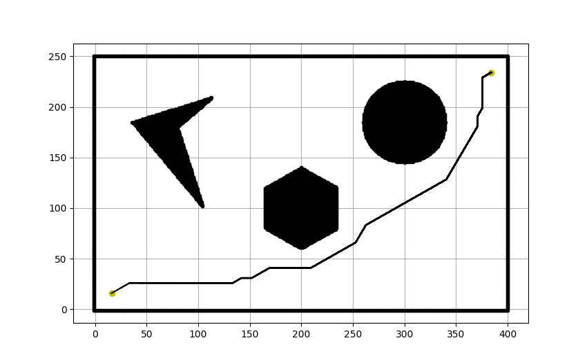

# AStar path planning for rigid body
Implementation of AStar path planning algorithm for rigid robot
## Requirements and Libraries Used:
- cv2
- python3
- Numpy
- argparse
- matplotlib

## Steps
- Run the following commands
``` bash
cd AStar_pathplanning/code
python3 main.py --start 16 16 0 --goal 317 51 0 --robot_radius 10 --step_size 10
```
### Parameters
- start -  Start position of the robot. *Default :- [16 16 0]*
- goal - Goal position of the robot. *Default :- [317 51 0]*
- robot_radius - Robot Radius. *Default :- 10*
- clearance - Obstacle clearance. *Default :- 5*
- step_size - Step size. *Default :- 10*
- visualize - Shows visualization after goal reached. *Default :- True* 

<p align="center">

</p>

### Final Backtrack Path example
<p align="center">

</p>

